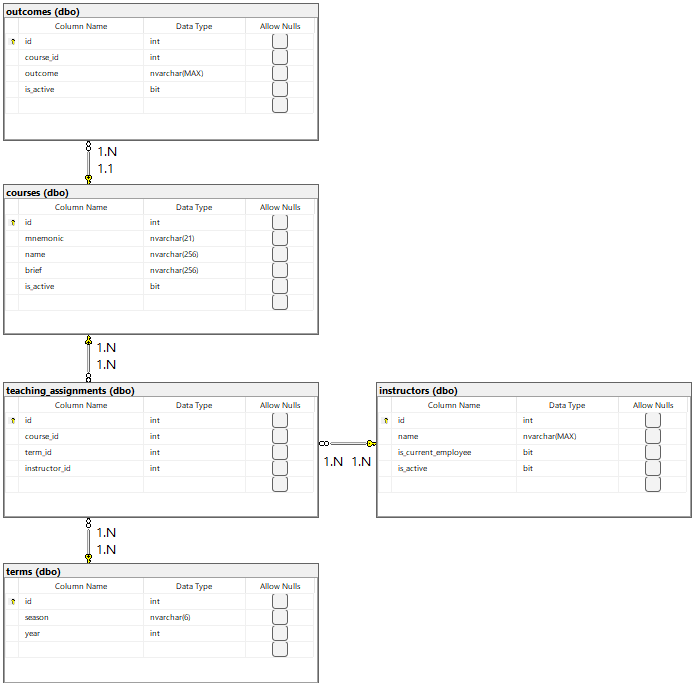

# Database Design and Build

## Introduction

There have been several questions from students, faculty, and staff on the topic of courses and curriculum in the University of Virginia (UVA) School of Data Science (SDS) Online Master of Science in Data Science (MSDS) program. It will be helpful to construct a database containing some information about the courses. One use case might be to view active learning outcomes for each active course. One use case might be to view the currently employed, active instructors assigned to teach the different active courses for each term in 2021. We may wish to ask ourselves, "Are there any other use cases we’d want this database to support?"

An active course is a course that will be taught again. An inactive course is a course that will not be taught again. A currently employed instructor is an instructor who presently works for the School of Data Science. A currently not employed instructor is an instructor who does not presently work for the School of Data Science. An active instructor is an instructor who will teach again. An inactive instructor is an instructor who will not teach again. An active learning outcome of a course is a learning outcome that will be achieved again by students who receive grade A+ for the course. An inactive learning outcome is a learning outcome that will not be achieved by students due to the intention due to faculty and staff leading the course.

See specifications for this UVA SDS Online MSDS Program Database Project in this Git repository.

## Data

The database is based on Excel workbook Current_Learning_Objectives_Raw_Data.xlsx in this repository provided by Efrain Olivares on 07/16/2024. The workbook contains a worksheet entitled, "Teaching Assignments: Instructors to Courses by Term" that contains tables of information for courses that were active for each of terms Spring 2021, Summer 2021, and Fall 2021 and the names of the instructors who were employed and active during those terms and taught those courses. One or more courses are taught in a given semester. A course might have one instructor or more instructors. Two instructors may teach different sections of the same course or co-teach a section of a course.

The workbook contains a worksheet with a table of instructor names and notes about which instructors are currently employed by the School of Data Science, a table of names of terms, and a table of course mnemonics (e.g., "DS 5001"), names, and short descriptions (i.e., briefs).

The workbook contains worksheets for all courses except for "SARC 5400: Data Visualization", each with a table of course mnemonics and learning outcomes.

## Database Design

### Database

We construct database UVA_SDS_Online_MSDS_Program_Database on server tom-levers-server.database.windows.net. We used Microsoft Azure: Cloud Computing Services. We used Visual Studio Code and the following ADO.NET connection string with SQL authentication to create, retrieve, update, and delete objects in the database.

```
Server=tcp:tom-levers-server.database.windows.net,1433;Initial Catalog=UVA_SDS_Online_MSDS_Program_Database;Persist Security Info=False;User ID=thomas.lever.business@gmail.com@tom-levers-server;Password={your_password};MultipleActiveResultSets=False;Encrypt=True;TrustServerCertificate=False;Connection Timeout=30;
```

We may view a table of the names of all tables in our database using the following code written in Transact SQL.

```
SELECT TABLE_NAME
FROM INFORMATION_SCHEMA.TABLES
WHERE TABLE_TYPE = 'BASE TABLE'
ORDER BY TABLE_NAME;
```

### Tables

Please see the below Entity Relationship Diagram and Relational Model. I followed Samuele Furnari and Diego Alberto Zapata Häntsch's responses at https://stackoverflow.com/questions/53293349/azure-data-studio-schema-diagram to generate automatically using Mermaid a Entity Relationship Diagram (ERD) and Relational Model. However, the relationships in this ERD were reversed. I then downloaded Microsoft SQL Server Management Studio and generated the below ERD.



Learning outcomes (LOs) capture what students should be able to do after taking a course (e.g., design and build a MySQL database). Learning outcomes vary in terms of detail as they are written by different instructors. Learning outcomes for each course must be in the database. We constructed table outcomes with columns id, course_id, outcome, and is_active. Column id is a not null primary key of whole numbers. Column course_id is a not null column of whole numbers that is a foreign key that references column id in table courses. Column outcome is a not null column of strings. Column is_active is a not null column of bits.

The employed, active instructors assigned to teach the different active courses for each term in 2021 must be in the database. We constructed table instructors with columns id, name, is_current_employee, and is_active. Column id is a not null primary key of whole numbers. Column name is a not null column of strings. Column is_current_employee is a not null column of bits. Column is_active is a not null column of bits.

We constructed table courses with columns id, mnemonic, name, brief, and is_active. Column id is a not null primary key of whole numbers. Column mnemonic is a not null, unique column of strings. Column name is a not null, unique column of strings. Column brief is a not null column of strings. Column is_active is a not null column of bits.

We constructed table terms with columns id, season, and year. Column id is a not null primary key of whole numbers. Column season is a not null column of instances of "Spring", "Summer", and "Fall". Column year is a not null natural number greater than or equal to 2021.

We constructed table teaching_assignments with columns id, course_id, term_id, and instructor_id. Column id is a not null primary key of whole numbers. Column course_id is a not null column of whole numbers that is a foreign key that references column id in table courses. Column term_id is a not null column of whole numbers that is a foreign key that references column id in table terms. Column instructor_id is a not null primary key of whole numbers that references column id in table instructors.

### Normalization

#### Zeroth Normal Form (0NF)

A table is not normalized as follows.

#### First Normal Form (1NF)

According to [1], "Normalization makes the database more able to accommodate changes in the structure of the data. It also protects the database against certain kinds of errors... Normalization is a process of rearranging the database to put it into a standard (normal) form that prevents these kinds of anomalies" and eliminates redundancy.

"The official qualifications for 1NF are:

1. Each column [in a table] must have a unique name.

2. The order of the rows and columns doesn't matter.

3. Each column must have a single data type.

4. No two rows can contain [all] identical values. Every table has a primary key.

5. Each column must contain a single value.

6. Columns cannot contain repeating groups [such as] Critter1, Critter2, and Critter3."

The tables in our database are in First Normal Form.

#### Second Normal Form (2NF)

"A table is in 2NF if:

1. It is in 1NF.

2. All of the non-key fields depend on all of the key fields.

"If you ensure that every table represents one single, unified concept such as wrestler or match, the table will be in 2NF."

The tables in our database are in Second Normal Form.

#### Third Normal Form (3NF)

"A table is in 3NF if:

1. It is in 2NF.

2. It contains no transitive dependencies.

A transitive dependency is when one non-key field's value depends on another non-key field's value."

According to [2], "Third normal form... is about refining the structure of the data to remove dependencies that aren't directly related to the primary key, ensuring clarity, reducing redundancy, and enhancing the integrity and flexibility of the database." Since all columns in each table are directly related to the primary key of the table, each table is in Third Normal Form.

#### Stopping at Third Normal Form

"Many database designers stop normalizing the database at 3NF because it provides the most bang for the buck. It's fairly easy to convert a database to 3NF and that level of normalization prevents the most common data anomalies. It stores separate data separately so you can add and remove pieces of information without destroying unrelated data. It also removes redundant data so the database isn't full of a zillion copies of the same information that waste space and make updating values difficult.

"However, the database may still be vulnerable to some less common anomalies that are prevented by the more complete normalizations described in the following sections. These greater levels of normalization are rather technical and confusing. They can also lead to unnecessarily complicated data models that are hard to implement, hard to maintain, and hard to use. In some cases, they can give worse performance than less completely normalized designs."

Let's stop at Third Normal Form.

### Indexes

According to [3], "An index is a database structure that makes it quicker and easier to find records based on the values in one or more fields... For example, suppose you have a Customers table that holds customer information: name, address, phone number, Swiss bank account number, and so forth. The table also contains a CustomerId field that it uses as its primary key. Unfortunately customers usually don't remember their customer IDs, so you need to be able to look them up by name or phone number. If you make Name and Phone Number be two different keys, you can quickly locate a customer's record in three ways: by customer ID, by name, and by phone number... Place indexes on the fields you are most likely to need to search."

We should build indexes for fields name of table instructors and name of table courses. We are most likely to need to search for instructor and course information.

### Constraints to Enforce

These actions should not be allowed:

1. Entering learning objectives for a course not offered by the School of Data Science

2. Assigning to a course an invalid instructor who is not currently employed or not active

3. Entering rows in table outcomes with an id that is not a whole number or a learning outcome that is a not a phrase

4. Entering rows in table courses with

    a. an id that is not a whole number

    b. a mnemonic that does not consist of a string of 2 to 4 letters, a space, and either two words separated by a space or a natural number with 4 digits

    c. a name that is not a phrase

    d. a brief that is not a phrase

    e. an indicator of whether a course is active other than 0 or 1

5. Entering rows in table instructors with

    a. an id that is not a whole number

    b. an indicator of whether an instructor is currently employeed other than 0 or 1

    c. an indicator of whether a course is active other than 0 or 1

6. Entering rows in table terms with

    a. an id that is not a whole number

    b. a season that is not "Spring", "Summer", or "Fall"

    c. a year that is less than 2021

7. Entering rows in table teaching_assignments with

    a. an id that is not a whole number

    b. a combination of course id, term id, and instructor id where a course is not offered in the corresponding term, a course is not taught by the corresponding instructor, or an instructor is not employed and active in the corresponding term

8. Relational Model

### Extending Database to Support UVA SDS Residential MSDS Program

We may be asked if our database could also support the UVA SDS Residential MSDS Program. We would have to add rows to tables courses, instructors, and outcomes. We may wish to introduce a column to distinguish between courses that are required online and required in person, required online and elective in person, required online and nonexistent in person, and so on. We may wish to introduce a column to distinguish between instructors who teach online, in person, both, and neither. We may wish to rename table teaching_assignments and introduce a new table to distinguish between teaching assignments for online courses and teaching assignments for residential courses.

## Database Analysis

Learning outcomes for each course must be in the database. A view of a table of mnemonics of active courses, names of those courses, and active learning outcomes of those courses may be selected using the following code written in Transact SQL.

```
SELECT mnemonic, name, outcome
FROM courses
LEFT JOIN outcomes
ON courses.id = course_id
WHERE courses.is_active = 1 AND outcomes.is_active = 1;
```

The employed, active instructors assigned to teach the different active courses for each term in 2021 must be in the database. A view of a table of mnemonics of active courses, names of those courses, seasons, years, and names of active, employed instructors may be selected using the following code written in Transact SQL.

```
SELECT
    mnemonic,
    courses.name as course_name,
    season,
    year,
    instructors.name as instructor_name
FROM teaching_assignments
LEFT JOIN courses
ON course_id = courses.id
LEFT JOIN terms
ON term_id = terms.id
LEFT JOIN instructors
ON instructor_id = instructors.id
```

## Uploading and Analyzing Data Using Snowflake

I used Snowflake to create tables from file. I saved tables courses, instructors, outcomes, teaching_assignments, and terms to CSV files. I uploaded those CSV files to create tables courses_csv, instructors_csv, outcomes_csv, teaching_assignments_csv, and terms_csv.

I used Snowflake to create tables as select. I created table table_of_mnemonics_names_and_active_outcomes_for_active_courses by creating a table based on the following query.

```
create table table_of_mnemonics_names_and_active_outcomes_for_active_courses_ERD as
    SELECT mnemonic, name, outcome
    FROM DS5111_SU24.tsl2b.courses_csv AS courses
    LEFT JOIN DS5111_SU24.tsl2b.outcomes_csv AS outcomes
    ON courses.id = course_id
    WHERE courses.is_active = 1 AND outcomes.is_active = 1;
```

I created table table_of_mnemonics_course_names_seasons_years_and_names_of_instructors by creating a table based on the following query.

```
create table table_of_mnemonics_course_names_seasons_years_and_names_of_instructors_erd as
    SELECT
        mnemonic,
        courses.name as course_name,
        season,
        year,
        instructors.name as instructor_name
    FROM DS5111_SU24.tsl2b.teaching_assignments_csv
    LEFT JOIN DS5111_SU24.tsl2b.courses_csv AS courses
    ON course_id = courses.id
    LEFT JOIN DS5111_SU24.tsl2b.terms_csv AS terms
    ON term_id = terms.id
    LEFT JOIN DS5111_SU24.tsl2b.instructors_csv AS instructors
    ON instructor_id = instructors.id
```

## References

1. Rod Stephens (2008). "Chapter 7. Normalizing Data". Beginning Database Design Solutions. https://learning.oreilly.com/library/view/beginning-database-design/9780470385494/ch07.html#what_is_normalization_question. Access 07/20/2024.

2. Nord Security (2024). "Third normal form". https://nordvpn.com/cybersecurity/glossary/third-normal-form/. Accessed 07/20/2024.

3. Rod Stephens (2008). "Chapter 3. Relational Database Fundamentals". Beginning Database Design Solutions. https://learning.oreilly.com/library/view/beginning-database-design/9780470385494/ch03.html#indexes. Accessed 07/20/2024.